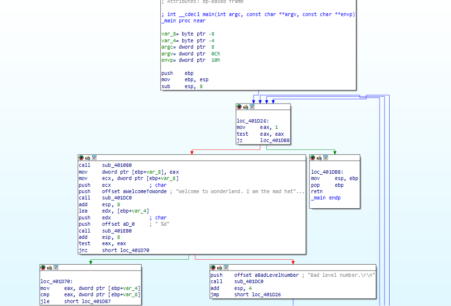
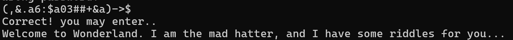

# RE 100 – Wonderland Stage 2

| Author      | Yossi Heifetz                               |
| ----------- | ------------------------------------- |
| Point Value | 20                                    |
| Description | Simple input sorter using static data |

---

## Challenge Description
When running the program, we're presented with the following message:
```
You know what? That was too easy. *Now* tell me the second password.
(Please enter the password)
Wrong password!
```

### Previous Passwords
For reference, the previous passwords were:
1. `All Hail The Queen`
2. `cd~e*~bo*xkhhc~*befo` (XOR'd with 10)


---

## Solution Walkthrough

### 1. Initial Analysis
1. First, load the .exe file in IDA

2. Open the string view (Shortcut: `SHIFT+F12`)
3. Search for the error message we saw in the terminal
4. Trace the string references to locate the relevant code

[View the assembly file](./stage_2_subruotine.asm)

### 2. Code Analysis
After following the references, we find the main password checking routine. The key points are:

1. The program XORs every 4-byte block of input with 'ARBA' (hex: `0x41524241`)
2. The encoded result is compared with the string `"into the rabbit hole"`

#### This is the actual code:
```assembly
        loc_4013D5:                             ; CODE XREF: sub_401330+87↑j
                mov     [ebp+Str], offset aIntoTheRabbitH_0 ; "into the rabbit hole"
                mov     eax, [ebp+Str]
                push    eax             ; Str
                call    strlen
                add     esp, 4
                push    eax             ; MaxCount
                mov     ecx, [ebp+Str]
                push    ecx             ; Str2
                lea     edx, [ebp+Buffer]
                push    edx             ; Str1
                call    ds:strncmp
                add     esp, 0Ch
                test    eax, eax
                jz      short loc_401413
                push    offset aWrongPassword_0 ; "Wrong password!\r\n"
                call    sub_401DC0
                add     esp, 4
                jmp     loc_401346
```


The magic happens in this line:                 

```
call    ds:strncmp
```

Here we compare the encoded string, and the string - "into the rabbit hole".
So what we need to do is create a string that when encoded will match this:

### 3. Implementation
Here's the Python script to decrypt the password:

```python
# Stage 2
def xor_decrypt_2(target_str, key=0x41524241):
    result = b''
    # pad to multiple of 4 bytes
    padded = target_str.encode('ascii')
    while len(padded) % 4 != 0:
        padded += b'\x00'

    for i in range(0, len(padded), 4):
        chunk = padded[i:i+4]
        chunk_val = int.from_bytes(chunk, byteorder='little')
        xored = chunk_val ^ key
        result += xored.to_bytes(4, byteorder='little')

    return result.rstrip(b'\x00')
```

This code will return the password:

```
(,&.a6:$a03##+&a)->$
```

And after entering this we get:

