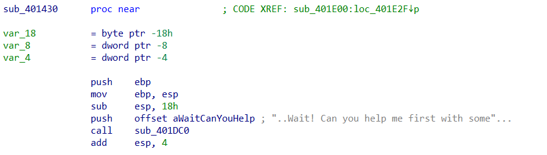

# RE 100 – Wonderland Stage 3

| Author      | Yossi Heifetz                               |
| ----------- | ------------------------------------- |
| Point Value | 20                                    |
| Description | Simple input sorter using static data |

---

This stage revolves around a short sequence of memory lookups and comparisons. The overall logic is pretty similar to stage 2,
we can follow the first steps to access the assembly code:



[View the assembly file](./stage_3_subruotine.asm)

### Step 1: Static Analysis

Using IDA, inspection of the `.data` section reveals a block of 16 bytes, apparently divided into 8 little-endian 2-byte integers.

```assembly
00404002: 21 00     ; => 0x0021 => 33
00404004: 01 00     ; => 0x0001 => 1
00404006: A8 FD     ; => 0xFDA8 => -600
00404008: 78 EC     ; => 0xEC78 => -5000
0040400A: F1 06     ; => 0x06F1 => 1777
0040400C: 0D 00     ; => 0x000D => 13
0040400E: 45 00     ; => 0x0045 => 69
```

### Step 2: Value Extraction and Sorting

We extract the values as:
We extract the values as:

```python
word_404000 = [7, 33, 1, -600, -5000, 1777, 13, 69]
```

This input appears to be transformed or sorted before being validated. We reverse the logic and deduce the check compares against the sorted order of values, preserving their  **original indices** .

### Step 3: Getting the Password

By sorting the values and retaining original indices:

This matches the accepted input! The binary compares the user's input to this order of indices.

### Final Python Script


```python

# Stage 3

defextract_valid_password():

    # Step 1: Raw bytes as found in the binary (little-endian)

    raw_bytes= [

    0x07, 0x00,  # 0 → 0x0007 = 7

    0x21, 0x00,  # 1 → 0x0021 = 33

    0x01, 0x00,  # 2 → 0x0001 = 1

    0xA8, 0xFD,  # 3 → 0xFDA8 = -600

    0x78, 0xEC,  # 4 → 0xEC78 = -5000

    0xF1, 0x06,  # 5 → 0x06F1 = 1777

    0x0D, 0x00,  # 6 → 0x000D = 13

    0x45, 0x00   # 7 → 0x0045 = 69

    ]

    # Step 2: Convert every pair of bytes into a signed 16-bit integer

    word_404000= []

    foriinrange(0, len(raw_bytes), 2):

    low=raw_bytes[i]

    high=raw_bytes[i+1]

    value= (high<<8) |low

    # Convert to signed 16-bit

    ifvalue>=0x8000:

    value-=0x10000

    word_404000.append(value)

    # Step 3: Map each value to its original index, then sort by value

    indexed=list(enumerate(word_404000))

    sorted_by_value=sorted(indexed, key=lambdax: x[1])

    indices= [str(index) forindex, _insorted_by_value]

    # Step 4: Join indices into string and return

    return' '.join(indices)
```

### Flag

The valid password to pass the check is:
```
4 3 2 0 6 1 7 5
```


